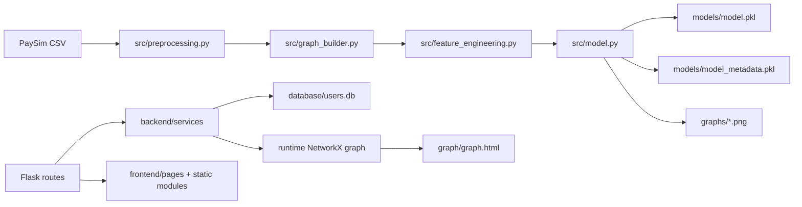

# Graph-Based Fraud Detection

Graph-Based Fraud Detection in Financial Transaction Networks using Machine Learning is a Flask application that combines PaySim-trained fraud scoring, runtime transaction monitoring, account risk tracking, anomaly detection, and NetworkX/PyVis graph visualization.

## Current Feature Set

- User registration, login, logout, and protected user dashboard
- Admin login and protected admin analytics dashboard
- SQLite persistence for users, transactions, alerts, and account reputation
- Balanced RandomForest fraud model trained on PaySim data only
- Custom fraud threshold selected from validation candidates
- ROC-AUC, precision-recall, confusion matrix, classification report, and feature importance outputs
- Runtime Isolation Forest anomaly checks for unusual amounts
- Explainable fraud alerts with human-readable reasons
- NetworkX graph updates after every transaction
- PyVis graph export with risk-colored nodes and amount-scaled edges
- Community detection for suspicious account clusters

## Architecture



Showcase assets:

```text
architecture.png
screenshots/
```

## Project Structure

```text
backend/
  config.py
  factory.py
  runtime.py
  auth_helpers.py
  presenters.py
  routes/
    admin.py
    auth.py
    pages.py
    transactions.py
  services/
    anomaly.py
    database.py
    graph_intelligence.py
    graph_visualizer.py
    scoring.py

frontend/
  pages/
    admin.html
    auth.html
    dashboard.html
    landing.html
  static/
    css/
    js/

src/
  preprocessing.py
  graph_builder.py
  feature_engineering.py
  feature_importance.py
  explainability.py
  model.py
  predict.py

database/
graph/
graphs/
models/
tests/
```

## Setup

Install dependencies:

```bash
pip install -r requirements.txt
```

Train and validate the model:

```bash
python src/model.py
```

Start the Flask app:

```bash
python app.py
```

Open:

```text
http://127.0.0.1:5000
```

## Dataset

The training pipeline expects the local PaySim CSV and uses only:

```python
nrows=100000
```

Runtime users and transactions are not used for retraining. They are only used for live prediction, dashboards, account reputation, and alerts.

## Main Pages

```text
/                 transaction monitor
/register         user registration
/login            user login
/user-dashboard   user dashboard
/admin            admin login/dashboard
/graph            latest PyVis graph export
```

Development admin credentials:

```text
Username: admin
Password: GraphAdmin#2026
```

## API Endpoints

```text
POST /api/register
POST /api/login
POST /api/logout
GET  /api/user/dashboard
POST /api/predict
POST /api/admin/login
POST /api/admin/logout
GET  /api/admin/status
GET  /api/admin/transactions
```

## Model Validation

`src/model.py` trains a balanced RandomForest model with:

- `class_weight="balanced"`
- fraud rows plus a 3x normal sample
- threshold comparison across `0.10`, `0.15`, `0.20`, and `0.25`
- saved best threshold in `models/model_metadata.pkl`

Training generates:

```text
models/model.pkl
models/feature_columns.pkl
models/model_metadata.pkl
models/feature_importance.json
graphs/roc_curve.png
graphs/precision_recall_curve.png
graphs/confusion_matrix.png
graphs/feature_importance.png
```

## Risk Levels

Fraud probabilities are displayed as:

```text
0-20%    LOW
20-50%   MEDIUM
50-80%   HIGH
80-100%  CRITICAL
```

These labels appear in user history, admin history, alerts, and graph node styling.

## Testing

Run the test suite:

```bash
python -m pytest
```

The project includes unit tests for preprocessing, graph building, prediction, anomaly detection, authentication, database services, explainability, scoring, graph intelligence, graph export, admin analytics, transaction routes, feature importance, and model validation.

Latest local verification:

```text
20 passed
78% coverage
```
